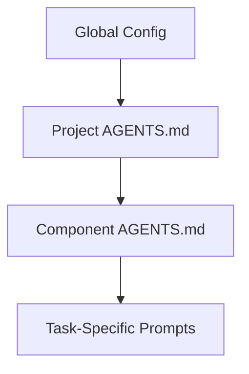

# AGENTS.md

## UI Component Standards

### Client Components
```
'use client'
// Required for interactive elements
```

### Server Components
```
// Use async/await for data fetching
export default async function Component() {
const data = await getData()
}
```

### Form Handling
- Use React Hook Form 7.4+[6][12]
- Server Actions for form submissions:
```
'use server'
export async function submitAction(formData: FormData) {
// Validate with Zod 3.22+[4][9]
}
```
```

---

### 4. AI Safety Constraints
```markdown
## Content Generation Guardrails

1. **Markdown Sanitization**
```
import DOMPurify from 'dompurify'
import { JSDOM } from 'jsdom'

const window = new JSDOM('').window
const purify = DOMPurify(window)

export function sanitizeMD(content: string) {
return purify.sanitize(marked.parse(content))
}
```

2. **Rate Limiting**
```
import { Ratelimit } from '@upstash/ratelimit'
import { Redis } from '@upstash/redis'

const ratelimit = new Ratelimit({
redis: Redis.fromEnv(),
limiter: Ratelimit.slidingWindow(10, "10 s")
})
```
```

---

### 5. CI/CD Configuration
```markdown
## Deployment Pipeline

### Vercel Settings
```
{
"buildCommand": "npm run build",
"outputDirectory": ".next",
"installCommand": "npm ci --prefer-offline"
}

### Supabase Migration
```bash
supabase db reset --force && supabase db push
```

### Post-Deploy Checks
```bash
curl -sSf https:///api/healthcheck | jq -e '.status == "OK"'
```

---

## Implementation Strategy

1. **Layered Configuration**


2. **Validation Workflow**
```bash
# Sample CI pipeline
codex --approval-mode full-auto "Implement lesson 3 features"
codex --no-project-doc "Verify against AGENTS.md standards"
```

3. **Performance Monitoring**
```ts
// Add performance markers
export const config = {
runtime: 'edge',
regions: ['iad1']
}